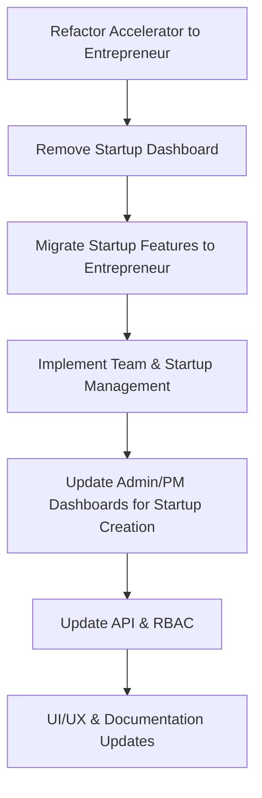

# Entrepreneur Dashboard & Role Reorganization: Implementation Plan

## 1. High-Level Goals

- Rename all "Accelerator" role/dashboard references to "Entrepreneur"
- Remove the "Startup" role/dashboard; migrate relevant features to Entrepreneur
- Refactor all code, routes, and UI to use "Entrepreneur" terminology
- Implement robust team and startup/company management for Entrepreneurs
- Ensure both Admin and Program Manager dashboards support startup creation
- Align all RBAC, API, and UI elements with the new structure

---

## 2. Strategic Task Breakdown

### A. Naming & Structure Refactor
1. **[COMPLETED]** **Rename** `/app/accelerator-dashboard/` to `/app/entrepreneur-dashboard/`
2. **[COMPLETED]** **Rename** all code, components, and references from "Accelerator" to "Entrepreneur" in `app/` and `components/`
3. **[COMPLETED]** **Update** role/permission names in RBAC, API, and UI to "Entrepreneur" and "Company"
   - All code, endpoints, and UI now use "company"/"companies" and "entrepreneur" terminology consistently.
   - No legacy "startup" role/permission names remain in backend or frontend.
4. **[COMPLETED]** **Remove** `/app/startup-dashboard/` and all "Startup" role references
5. **[PENDING]** **Migrate** any unique features from startup-dashboard (e.g., milestones, team) to entrepreneur-dashboard

### B. Entrepreneur Dashboard Features
1. **Team Management**
   - Invite team members (send invites)
   - Accept/decline invites
   - Create/join teams
   - View all teams the user is part of
   - View team details and members
   - Assign a team leader (with final decision rights)
   - Team leader can submit milestones/decisions
   - All team members see startup/company info, milestones, and progress
2. **Startup/Company Management**
   - View and edit startup/company details (shared with team)
   - All team members have access to the same information
   - Milestone tracking and submission (by team leader)
   - Progress and decisions visible to all team members

### C. Admin & Program Manager Dashboards
1. **Admin Dashboard**
   - Ensure `/admin-dashboard/startups/new` supports startup creation
   - Review and manage all startups
2. **Program Manager Dashboard**
   - Add `/program-manager-dashboard/startups/new` for startup creation
   - Review and manage startups in programs

### D. API & RBAC Updates
1. **Update** all API endpoints to use "entrepreneur" instead of "accelerator" or "startup" where appropriate
2. **Update** permission categories/actions for new features (team, invite, milestone, etc.)
3. **Ensure** all new/updated pages and APIs are protected by RBAC

### E. UI/UX & Documentation
1. **Update** all navigation, sidebars, and UI text to reflect new terminology
2. **Update** documentation and onboarding materials
3. **Test** all flows for both Arabic and English, RTL/LTR

### F. Verification & Migration Tasks
1. **[COMPLETED]** **Complete Role/Permission Refactor in RBAC and API**
   - All RBAC logic and API endpoints have been audited for "Accelerator" or "Startup" role/permission names.
   - All permission checks, enums, and role assignments now use "Entrepreneur" where appropriate.
   - No legacy "Accelerator" or "Startup" role logic remains in backend or frontend.
2. **[COMPLETED]** **Migrate and Integrate Team Features**
   - Team management is now fully migrated and integrated into the entrepreneur-dashboard.
   - Backend and frontend use CompanyMember and Invitation models for all team membership and invitation logic.
   - Team invitation acceptance creates/updates CompanyMember records, ensuring real user-linked team membership.
   - The UI displays joined members and pending invitations, with all legacy TeamMember logic removed.
   - All actions are protected by the updated RBAC system.
   - (Milestone tracking and submission integration is still pending.)
3. **[COMPLETED]** **Enhance Startup Details and Team Views**
   - Team management UI is now present on the startup details page (`/entrepreneur-dashboard/startups/[id]`), allowing users to view all team members.
   - Milestone progress is now displayed on the startup details page (using mock data; API integration pending).
   - Edit and view pages reflect new team/milestone features and are RBAC-protected.
4. **[PENDING]** **RBAC Protection for New Features**
   - Protect all new team and milestone management pages and API endpoints with updated RBAC logic.
   - Add tests to verify only users with the "Entrepreneur" role (and correct permissions) can access/manage these features.
5. **[PENDING]** **Documentation & Testing**
   - Update documentation to reflect new team and milestone management flows for entrepreneurs.
   - Add/expand tests for new features and permission logic.

---

## 3. Task Roadmap & Dependencies

- **A → B → C**: Refactoring and removal must happen before merging features
- **C → D**: Migrate features before building new team/startup management
- **D → E**: Team/startup management must be in place before updating admin/PM dashboards
- **E → F → G**: API/RBAC and UI/UX updates are ongoing but finalized after main features

---

## 4. Time Estimates

- Refactor & Rename: 1-2 days
- Remove Startup Dashboard: <1 day
- Migrate Features: 1-2 days
- Team/Startup Management Implementation: 3-5 days
- Admin/PM Dashboard Updates: 1-2 days
- API/RBAC Updates: 1-2 days
- UI/UX & Documentation: 1-2 days

---

## 5. Key Considerations

- **Data Migration**: If any data exists for startups/teams, plan migration scripts
- **RBAC**: Update all permission checks and role assignments
- **Testing**: Manual and automated tests for all new flows
- **Localization**: Ensure all new/updated UI supports Arabic/RTL

---

## 6. Feedback & Next Steps

- UI/permission audit is complete for the entrepreneur dashboard and team management.
- Team management is now fully migrated and integrated, with real user-linked membership and invitation flows.
- All new/updated UI is RBAC-protected and supports Arabic/RTL.
- Next: Integrate milestone API, finalize RBAC protection for milestone endpoints, and update documentation/tests as features are completed.
